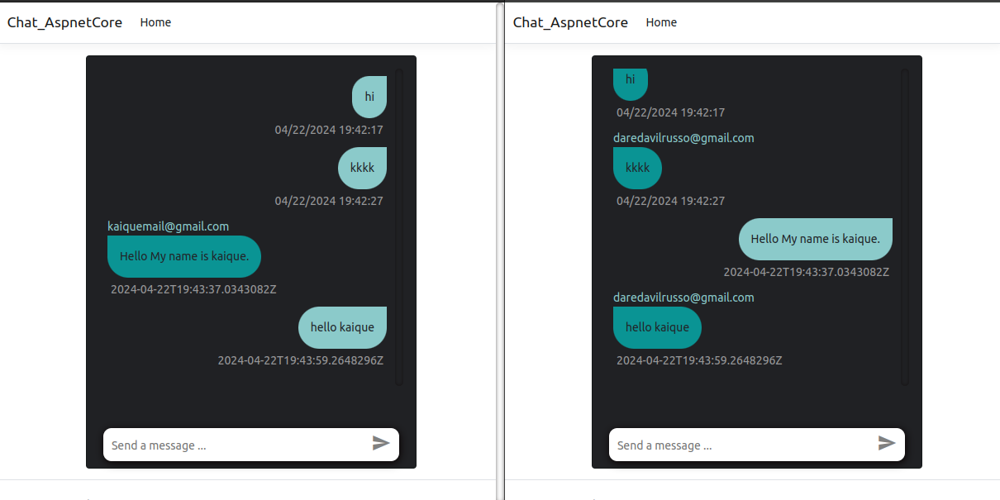

# CHAT Aspnet Core

### Overview
This is a simple chat using signalr by aspnet core implementation.
What is important to tell is that it's code is a just example to make something same
a broadcasting messages using csharp/Dotnet Core.

### How to run?

You must to restore this app and run a command docker-compose,
so after it i'll must to migrate the tables for database host

Step 0:

    dotnet restore

Step 1:

    docker-compose build

Step 2:

    docker-compose up -d

Step 3:
#### MIGRATE DATABASE

Run

    ./migrate.sh

On bash of container run

    dotnet ef tool-restore
    dotnet ef database update

> Please don't forget of make a file .env you can copy the .env-example for you and  configurate the application. Is Importanto to tell that the password of database you must change in the docker-compose.yml file too for you password database.

the application will be running in host `` http://localhost:8080/``
